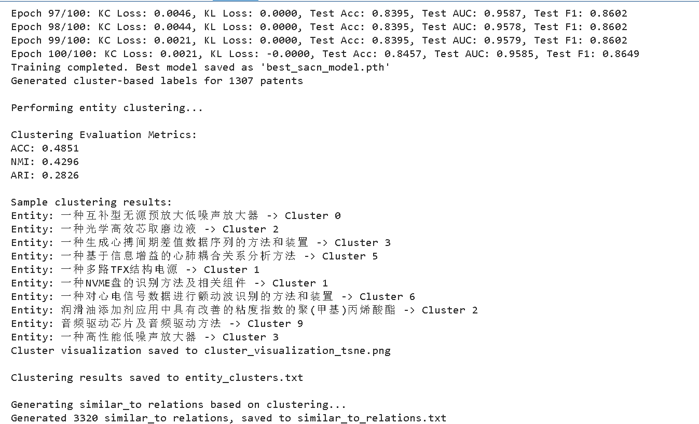

# 知识图谱感知的专利成果聚类模型开发实践

| 姓名   | 学号     | 分工                                                    |
| ------ | -------- | ------------------------------------------------------- |
| 曾智皓 | 22336027 | 负责Django算法封装、Spring Boot框架搭建及实验报告的编写 |
| 陈俊廷 | 22336034 | 负责预训练聚类模型及实验报告的编写                      |
| 魏景尧 | 21306307 | 负责前端页面开发和接口对接以及实验报告的编写            |

### 一、算法任务

##### （1）预训练聚类模型

1. 数据预处理（WGCN）
2. 知识图谱实体表征强化
3. 知识图谱的知识补全
4. 自监督实体聚类
5. 系统评测（ACC、NMI、ARI）

##### （2）算法封装和接口发布

##### （3）Spring Boot框架搭建

##### （4）前端页面开发和接口对接

### 二、算法设计思路

##### 1）预训练聚类模型

1. ###### 数据预处理（WGCN）

   1. 数据加载与预处理

   `load_patent_data`函数负责从文本文件中加载专利数据，并将其组织为结构化的知识图谱数据：

   ```python
   def load_patent_data(file_path):
       """从文件加载专利数据并分开存储"""
       patent_data = defaultdict(lambda: {
           'titleKey': set(),
           'bgKey': set(),
           'clKey': set(),
           'patentee': set()
       })
   
       with open(file_path, 'r', encoding='utf-8') as f:
           for line in f:
               line = line.strip()
               if not line:
                   continue
   
               # 解析每行数据
               parts = line.split('---')
               if len(parts) != 3:
                   continue
   
               patent = parts[0].strip()
               relation = parts[1].strip()
               value = parts[2].strip()
   
               # 处理值可能是列表的情况
               if value.startswith('[') and value.endswith(']'):
                   try:
                       values = eval(value)
                       for v in values:
                           patent_data[patent][relation].add(str(v).strip("'"))
                   except:
                       continue
               else:
                   patent_data[patent][relation].add(value.strip("'"))
   
       return patent_data
   ```

   - 使用defaultdict存储每个专利的四种关系(titleKey, bgKey, clKey, patentee)
   - 处理单值和列表值两种情况
   - 返回一个以专利为键，包含各类关系的字典

   ###### 2. 图构建

   `build_graph`函数将专利数据转换为图结构：

   ```python
   def build_graph(patent_data):
       """构建整个专利知识图谱"""
       # 收集所有节点
       patents = list(patent_data.keys())
       keywords = set()
       patentees = set()
   
       for patent, relations in patent_data.items():
           keywords.update(relations['titleKey'])
           keywords.update(relations['bgKey'])
           keywords.update(relations['clKey'])
           patentees.update(relations['patentee'])
   
       keywords = list(keywords)
       patentees = list(patentees)
       nodes = patents + keywords + patentees
       node2idx = {node: i for i, node in enumerate(nodes)}
   
       # 构建边
       edges = []
       edge_types = []
       relation2type = {'titleKey': 1, 'bgKey': 2, 'clKey': 3, 'patentee': 4}
   
       for patent, relations in patent_data.items():
           for rel_type, values in relations.items():
               for value in values:
                   src = node2idx[patent]
                   dst = node2idx[value]
                   edges.append([src, dst])
                   edge_types.append(relation2type[rel_type])
   
       # 转换为张量
       edge_index = torch.tensor(edges, dtype=torch.long).t()
       edge_type = torch.tensor(edge_types, dtype=torch.long)
       num_nodes = len(nodes)
   
       # 初始化特征 (可以使用预训练的词向量)
       nfeat = 128
       x = torch.randn(num_nodes, nfeat)
   
       return (edge_index, edge_type, num_nodes), x, node2idx, patents
   ```

   - 收集所有节点(专利、关键词、专利权人)
   - 为每个节点分配唯一索引
   - 构建边和边类型(四种关系分别映射为1-4)
   - 初始化节点特征(这里使用随机特征，实际应用中可用预训练词向量)

   ###### 3. 加权图卷积网络(WGCN)架构

   GraphConvolution层

   ```python
   class GraphConvolution(nn.Module):
       def __init__(self, in_features, out_features, num_relations, bias=True):
           super(GraphConvolution, self).__init__()
           self.in_features = in_features
           self.out_features = out_features
           self.weight = Parameter(torch.FloatTensor(in_features, out_features))
           self.num_relations = num_relations
           self.alpha = nn.Embedding(num_relations + 1, 1, padding_idx=0)
   
           if bias:
               self.bias = Parameter(torch.FloatTensor(out_features))
           else:
               self.register_parameter('bias', None)
           self.reset_parameters()
   
       def reset_parameters(self):
           stdv = 1. / math.sqrt(self.weight.size(1))
           self.weight.data.uniform_(-stdv, stdv)
           if self.bias is not None:
               self.bias.data.uniform_(-stdv, stdv)
   
       def forward(self, input, adj):
           alp = self.alpha(adj[1]).t()[0]
           A = torch.sparse_coo_tensor(adj[0], alp, torch.Size([adj[2], adj[2]]))
           A = A + A.transpose(0, 1)  # 使矩阵对称
   
           support = torch.mm(input, self.weight)
           output = torch.sparse.mm(A, support)
   
           if self.bias is not None:
               return output + self.bias
           else:
               return output
   ```

   - 核心创新点是引入了关系特定的权重(alpha)
   - 对每种关系类型学习不同的重要性权重
   - 通过稀疏矩阵乘法实现高效的图卷积运算
   - 支持对称化处理(使矩阵对称)

   WGCN模型

   ```python
   class WGCN(nn.Module):
       def __init__(self, nfeat, nhid, nclass, num_relations, dropout=0.5):
           super(WGCN, self).__init__()
           self.gc1 = GraphConvolution(nfeat, nhid, num_relations)
           self.gc2 = GraphConvolution(nhid, nclass, num_relations)
           self.dropout = dropout
   
       def forward(self, x, adj):
           x = F.relu(self.gc1(x, adj))
           x = F.dropout(x, self.dropout, training=self.training)
           x = self.gc2(x, adj)
           return x  # 不进行softmax，直接返回嵌入
   ```

   - 两层图卷积结构(gc1和gc2)
   - 第一层使用ReLU激活函数和Dropout
   - 第二层不进行激活，直接输出嵌入
   - 整体结构简单但有效，适合中等规模图数据

   4. ###### 训练过程

   `train_wgcn`函数实现了模型训练：

   ```python
   def train_wgcn(adj, features, num_relations):
       """训练WGCN模型"""
       nhid = 64
       nclass = 32
       dropout = 0.3
       epochs = 200
   
       model = WGCN(features.shape[1], nhid, nclass, num_relations, dropout)
       optimizer = torch.optim.Adam(model.parameters(), lr=0.01)
   
       model.train()
   ```

   - 使用Adam优化器
   - 采用简单的MSE重建损失(作为示例)
   - 支持GPU加速
   - 训练500个epoch，每20个epoch打印一次损失

   5. ###### 嵌入保存

   `save_patent_embeddings`函数将学习到的专利嵌入保存到文件：

   - 每个专利的嵌入向量以空格分隔的字符串形式存储
   - 包含专利ID和对应嵌入

2. 知识图谱实体表征强化

   ###### 1. 实验目标与总体思路

   通过强化学习方法优化预训练的专利嵌入表示，使其更好地捕捉专利间的语义和结构关系。

   **创新思路**：将专利表示学习问题转化为强化学习任务，其中：

   - 智能体(策略网络)学习判断专利关系
   - 环境(专利知识图谱)提供正负样本和奖励信号
   - 通过策略梯度方法优化嵌入表示

   ###### 2. 数据准备与预处理

   数据加载

   ```python
   # 加载专利数据
       patent_data = defaultdict(lambda: {
           'titleKey': set(),
           'bgKey': set(),
           'clKey': set(),
           'patentee': set()
       })
   
       files = [
           'new_title_triplets.txt',
           'new_bg_triplets.txt',
           'new_cl_triplets.txt',
           'new_patentee_triplets.txt'
       ]
   ```

   - 从四个关系文件中加载专利数据(titleKey, bgKey, clKey, patentee)
   - 处理单值和多值情况，清洗数据格式
   - 使用defaultdict构建结构化的专利关系字典

   嵌入初始化

   ```python
   # 加载嵌入（load_patent_embeddings函数）
   def load_patent_embeddings(file_path, device):
       embeddings = {}
       with open(file_path, 'r') as f:
           for line in f:
               parts = line.strip().split('\t')
               embedding = np.array([float(x) for x in parts[1].split()], dtype=np.float32)
               embeddings[parts[0]] = torch.tensor(embedding, device=device)
       return embeddings
   ```

   - 加载预训练的专利嵌入(patent_embeddings.txt)
   - 自动检测GPU设备并将嵌入转移到GPU
   - 过滤掉没有有效嵌入或关系的专利

   关键预处理步骤

   ```python
   # PatentEnvironment.__init__()
   self.negative_candidates = {}
   for patent_id in self.patent_ids:
       related_values = set()
       for rel_type in ['titleKey', 'bgKey', 'clKey', 'patentee']:
           if rel_type in patent_data[patent_id]:
               related_values.update(patent_data[patent_id][rel_type])
       candidate_pool = self.valid_patents_set - related_values
       self.negative_candidates[patent_id] = [v for v in candidate_pool if v in self.embeddings]
   ```

   - 构建负样本候选池：为每个专利预计算有效负样本集合
   - 关系类型编码：将四种关系映射为数字索引(1-4)
   - 正样本构建：生成(专利, 关联值, 关系类型)三元组列表

   ###### 3. 强化学习环境设计

   状态表示

   ```python
   # PatentEnvironment._get_current_state()
   return {
       'patent_emb': self.embeddings[patent],  # 专利嵌入
       'value_emb': self.embeddings[value],    # 关联值嵌入 
       'rel_type': self.relation_to_idx[rel_type]  # 关系类型索引
   }
   ```

   - 专利嵌入
   - 关联值嵌入
   - 关系类型索引

   动作空间

   - 二元选择：判断当前样本是正样本(0)还是负样本(1)

   奖励机制

   ```python
   # PatentEnvironment.step()
   if action == 0:  # 正样本
       reward = F.cosine_similarity(patent_emb, value_emb)  # 余弦相似度
   else:  # 负样本
       neg_value = random.choice(self.negative_candidates[patent])
       reward = -F.cosine_similarity(patent_emb, self.embeddings[neg_value])  # 负相似度
   ```

   - 正样本：专利与关联值的余弦相似度
   - 负样本：专利与随机负样本的负余弦相似度
   - 设计合理：直接优化嵌入空间的相似性关系

   ###### 4. 策略网络架构

   双网络设计

   ```python
   # RepresentationPolicy.__init__()
   # 策略网络
   self.policy_net = nn.Sequential(
       nn.Linear(embedding_dim*3, 256),
       nn.ReLU(),
       nn.Linear(256, 128),
       nn.ReLU(), 
       nn.Linear(128, 2)  # 输出正/负样本概率
   )
   
   # 价值网络
   self.value_net = nn.Sequential(
       nn.Linear(embedding_dim*3, 256),
       nn.ReLU(),
       nn.Linear(256, 128),
       nn.ReLU(),
       nn.Linear(128, 1)  # 状态价值估计
   )
   ```

   1. **策略网络**：
      - 输入：专利嵌入、关联值嵌入、关系嵌入的拼接
      - 结构：3层MLP(256-128-2)
      - 输出：正/负样本的动作概率
   2. **价值网络**：
      - 共享底层特征提取
      - 结构：3层MLP(256-128-1)
      - 输出：状态价值估计

   关系嵌入层

   ```python
   self.relation_emb = nn.Embedding(num_relations+1, embedding_dim, padding_idx=0)
   ```

   - 专门学习四种关系的表示
   - 增强模型对关系类型的感知能力

   ###### 5. 训练策略与优化

   训练流程

   ```python
   # ReinforcedRepresentationLearner.train()
   # 计算优势
   advantages = returns - values.detach()
   
   # 计算损失
   policy_loss = -(log_probs * advantages.detach()).mean()
   value_loss = F.mse_loss(values, returns)
   entropy_bonus = entropies.mean()
   
   total_loss = policy_loss + 0.5*value_loss - 0.01*entropy_bonus
   ```

   1. 收集轨迹：智能体与环境交互生成(state, action, reward)序列
   2. 计算回报：使用折扣因子γ=0.99
   3. 优势估计：回报减去基线值
   4. 策略更新：使用带熵正则化的策略梯度

   优化技术

   - **回报标准化**：(回报-均值)/标准差，稳定训练
   - **熵正则化**：系数0.01，鼓励探索
   - **梯度裁剪**：最大范数0.5，防止梯度爆炸
   - **双损失函数**：结合策略损失(0.5权重)和价值损失

   超参数设置

   - 学习率：1e-4
   - 折扣因子γ：0.99
   - 训练episode：500
   - 批量大小：32

   ###### 6. 嵌入更新机制

   ```python
   # ReinforcedRepresentationLearner.update_embeddings()
   for patent_id, emb in self.env.embeddings.items():
       update = torch.zeros_like(emb)
       for rel_type, values in relations.items():
           action_logits, _ = self.policy(emb, self.env.embeddings[value], rel_tensor)
           positive_prob = F.softmax(action_logits, dim=-1)[0, 0].item()
           update += positive_prob * self.env.embeddings[value]
       updated_emb = emb + 0.1 * update  # 加权更新
   ```

   训练完成后，使用学习到的策略更新嵌入：

   1. 对每个专利，收集其所有关系的正样本
   2. 用策略网络计算每个正样本的权重(正样本概率)
   3. 执行加权平均：新嵌入 = 原嵌入 + 0.1 * 加权聚合嵌入
   4. 保存为numpy格式，保留6位小数精度

   ###### 7. 实验控制与可复现性

   随机种子设置

   ```python
   if __name__ == '__main__':
       torch.manual_seed(42)
       np.random.seed(42)
       random.seed(42)
       if torch.cuda.is_available():
           torch.cuda.manual_seed_all(42)
           torch.backends.cudnn.deterministic = True
   ```

   - 固定PyTorch、NumPy和Python随机种子(42)
   - CUDA确定性模式(确保GPU结果可复现)

   错误处理

   ```python
   try:
       patent_embeddings = load_patent_embeddings('patent_embeddings.txt', device)
   except FileNotFoundError:
       print("Error: patent_embeddings.txt not found.")
       return
   ```

   - 文件缺失处理
   - 数据格式异常捕获
   - 训练过程中的异常处理

3. 知识图谱的知识补全

   ###### 1. 整体架构设计

   **核心思想**：结合卷积神经网络与知识图谱嵌入的混合模型（SACN）

   ```python
   class SACN(nn.Module):
       def __init__(self, num_entities, num_relations, embedding_dim, init_embeddings, ...):
           # 实体嵌入层（使用预训练嵌入初始化）
           self.emb_e = nn.Embedding.from_pretrained(torch.FloatTensor(init_embeddings), freeze=False)
           # 关系嵌入层
           self.emb_rel = nn.Embedding(num_relations, embedding_dim)
           # 1D卷积层（核心创新点）
           self.conv1 = nn.Conv1d(2, channels, kernel_size, padding=int(math.floor(kernel_size/2)))
           # 全连接层
           self.fc = nn.Linear(embedding_dim * channels, embedding_dim)
   ```

   **关键设计**：

   - 双通道输入：实体嵌入+关系嵌入拼接后作为CNN输入
   - 卷积操作捕捉局部特征模式
   - 保留传统KGE模型的嵌入特性

   ###### 2. 数据预处理流程

   **实体与关系映射**：

   ```python
   # KnowledgeCompletion.__init__()
   self.entity2id = {entity: idx for idx, entity in enumerate(entity_embeddings.keys())}
   self.relation2id = {rel: idx for idx, rel in enumerate(set(t[1] for t in triplets))}
   ```

   **负采样策略**：

   ```python
   def generate_negative_samples(self, triplets, num_negatives=1):
       negative_triplets = []
       for h, r, t in triplets:
           # 仅替换尾实体生成负样本
           neg_t = random.randint(0, self.num_entities-1)
           while neg_t == t:
               neg_t = random.randint(0, self.num_entities-1)
           negative_triplets.append((h, r, neg_t))
       return negative_triplets
   ```

   **特点**：

   - 基于替换的负采样（Corruption-based）
   - 控制负样本数量与正样本1:1比例

   ###### 3. 模型核心创新点

   **卷积特征提取**：

   ```python
   def forward(self, e1, rel):
       # 拼接双嵌入 (batch, 2, emb_dim)
       stacked_inputs = torch.stack([e1_embedded, rel_embedded], dim=1)  
       
       # 1D卷积处理
       x = self.conv1(stacked_inputs)  # (batch, channels, emb_dim)
       x = F.relu(self.bn1(x))
       
       # 展平后全连接
       x = x.view(batch_size, -1)  # (batch, channels*emb_dim)
       x = self.fc(x)  # 降回emb_dim
   ```

   **优势**：

   - 通过CNN捕捉实体-关系交互的局部模式
   - 相比纯点积模型具有更强的特征组合能力

   ###### 4. 训练优化策略

   **损失函数设计**：

   ```python
   # 二元交叉熵损失
   self.loss = nn.BCELoss()
   
   # 计算方式
   pred = model(h, r)  # 所有实体概率
   pred_t = pred[torch.arange(len(t)), t]  # 目标实体概率
   loss = model.loss(pred_t, batch_labels)  # 正/负样本标签
   ```

   **训练流程**：

   ```python
   # 混合正负样本
   all_train = train_triplets + neg_train  
   train_labels = [1]*len(train_triplets) + [0]*len(neg_train)
   
   # 批量训练
   for i in range(0, len(train_triplets_tensor), batch_size):
       optimizer.zero_grad()
       loss.backward()
       optimizer.step()
   ```

   ###### 5. 评估与预测

   **多指标评估**：

   ```python
   def evaluate(self, model, triplets_tensor, labels_tensor):
       # 计算预测概率
       all_preds = torch.cat(all_preds).numpy()
       
       # 关键指标
       accuracy = accuracy_score(all_labels, binary_preds)
       auc = roc_auc_score(all_labels, all_preds) 
       f1 = f1_score(all_labels, binary_preds)
   ```

   **链接预测**：

   ```py
   def predict_missing_links(self, model, head_entity, relation, top_k=10):
       pred = model(h_tensor, r_tensor)  # 所有尾实体概率
       top_indices = np.argsort(pred)[::-1][:top_k]  # Top-K排序
   ```

   ###### 6. 工程优化设计

   **GPU加速**：

   ```python
   # 自动设备选择
   device = 'cuda' if torch.cuda.is_available() else 'cpu'
   model.to(device)
   data_tensor.to(device)
   ```

   **可复现性**：

   ```python
   # 固定所有随机种子
   torch.manual_seed(42)
   np.random.seed(42)
   random.seed(42)
   if torch.cuda.is_available():
       torch.cuda.manual_seed_all(42)
   ```

4. 自监督实体聚类

   ###### 1. 整体架构设计

   **双任务联合学习框架**：

   ```python
   class SACN(nn.Module):
       def __init__(self, ..., num_clusters=10):
           # 知识补全组件
           self.emb_e = nn.Embedding.from_pretrained(...)  # 实体嵌入
           self.emb_rel = nn.Embedding(...)  # 关系嵌入
           self.conv1 = nn.Conv1d(...)  # 卷积层
           
           # 聚类组件
           self.cluster_fc = nn.Linear(embedding_dim, num_clusters)  # 聚类全连接层
           self.kl_loss = ...  # 聚类正则化损失
   ```

   **创新点**：

   - 共享底层实体嵌入表示
   - 通过KL散度实现自监督聚类（DeepCluster思想）
   - 卷积层捕捉局部特征模式

   ###### 2. 数据流设计

   **前向传播流程**：

   ```python
   def forward(self, e1, rel, return_cluster=False):
       # 特征提取
       x = self.conv1(torch.stack([e1_emb, rel_emb], dim=1))  # [batch, 2, dim]->[batch, channels, dim]
       x = self.fc(x.view(batch_size, -1))  # 展平后全连接
       
       # 双任务输出
       cluster_q = F.softmax(self.cluster_fc(x), dim=1)  # 聚类分布
       kc_pred = torch.sigmoid(torch.mm(x, self.emb_e.weight.T))  # 知识补全预测
   ```

   **特点**：

   - 卷积层处理实体-关系交互特征
   - 共享特征同时服务两个任务

   ###### 3. 损失函数设计

   **多目标损失组合**：

   ```python
   # 训练循环中的损失计算
   kc_loss = model.loss(pred_t, batch_labels)  # 二元交叉熵
   kl_loss = model.kl_loss(cluster_q)  # KL散度正则化
   total_loss = kc_loss + lambda_cluster * kl_loss  # 加权求和
   ```

   **KL散度计算**：

   ```python
   def kl_loss(self, q):
       weight = q**2 / q.sum(0)  # 计算软分配权重
       p = (weight.t() / weight.sum(1)).t()  # 目标分布
       return F.kl_div(q.log(), p, reduction='batchmean')  # KL(P||Q)
   ```

   **优势**：

   - 避免聚类退化问题（单簇主导）
   - 自适应调整目标分布

   ###### 4. 聚类实现方案

   **两种聚类方式**：

   ```python
   def cluster_entities(self, model, use_kmeans=True):
       if use_kmeans:
           # 传统K-means聚类
           from sklearn.cluster import KMeans
           kmeans = KMeans(n_clusters=n_clusters)
           cluster_ids = kmeans.fit_predict(embeddings_np)
       else:
           # 模型自带聚类层
           cluster_logits = model.cluster_fc(entity_embeddings)
           cluster_ids = torch.argmax(cluster_logits, dim=1)
   ```

   **可视化支持**：

   ```python
   def visualize_clusters(self, ..., method='pca'):
       if method == 'tsne':
           reducer = TSNE(n_components=2)
       else:
           reducer = PCA(n_components=2)
       embeddings_2d = reducer.fit_transform(embeddings_np)
       plt.scatter(..., c=labels_np, cmap='tab20')
   ```

   ###### 5. 评估体系设计

   **知识补全评估**：

   ```python
   def evaluate(self, ...):
       # 标准分类指标
       accuracy = accuracy_score(all_labels, binary_preds)
       auc = roc_auc_score(all_labels, all_preds) 
       f1 = f1_score(all_labels, binary_preds)
   ```

   ###### 6. 工程优化设计

   **GPU加速**：

   ```python
   device = 'cuda' if torch.cuda.is_available() else 'cpu'
   model.to(device)
   data_tensor.to(device)
   ```

5. 系统评测（ACC、NMI、ARI）

   **聚类评估**：

   ```python
   def evaluate_clustering(self, ...):
       # 三种聚类指标
       nmi = normalized_mutual_info_score(true_label_list, pred_labels)
       ari = adjusted_rand_score(true_label_list, pred_labels)
       acc = ... # 通过匈牙利算法匹配
   ```

##### （2）算法封装和接口发布

本实验以Django作为应用程序接口（application program interface,API）框架，项目结构如下：

```
sulab/
│
├── data/                      # 数据存储目录（非Django标准目录，自定义）
│   ├── embeddings/            # 实体嵌入向量数据
│   │   └── refined_patent_embeddings.txt  # 强化后的专利嵌入向量
│   ├── model/                 # 机器学习模型存储
│   │   ├── best_sacn_model.pth       # 原始SACN模型参数
│   │   └── best_sacn_model_v2.pth    # 更新后的模型参数
│   └── triplets/              # 三元组数据文件
│       ├── new_title_triplets.txt     # 原始三元组数据
│       └── similar_to_relations.txt   # 生成的相似关系数据
│
├── kgpc/                      # Django应用目录（专利知识图谱核心功能）
│   ├── migrations/            # 数据库迁移文件（自动生成）
│   ├── utils/                 # 工具模块
│   │   ├── __init__.py        # 包初始化文件
│   │   ├── entity_clustering.py  # 实体聚类算法实现
│   │   ├── model_loader.py    # 模型加载工具
│   │   └── relation_generator.py # 关系生成器
│   ├── __init__.py            # 应用包声明
│   ├── admin.py               # 后台管理配置
│   ├── apps.py                # 应用配置类
│   ├── models.py              # 数据模型定义
│   ├── tests.py               # 测试用例
│   ├── urls.py                # 应用级URL路由
│   └── views.py               # 视图处理逻辑
│
└── sulab/                     # 项目配置目录（与项目同名）
    ├── __init__.py            # Python包声明
    ├── asgi.py                # ASGI服务器配置
    ├── settings.py            # 项目全局设置
    ├── urls.py                # 项目级URL路由
    ├── wsgi.py                # WSGI服务器配置
    ├── check_urls.py          # URL检查工具（自定义）
    ├── db.sqlite3             # SQLite数据库文件（开发用）
    ├── manage.py              # Django命令行工具
    ├── README.md              # 项目说明文档
    ├── test_urls.py           # URL测试脚本（自定义）
    └── .gitignore             # Git忽略规则
```

###### 1.系统架构设计

**MVC模式实现**：

```python
class PatentRecommend(View):  # Django的类视图基类
    def get(self, request):  # 处理GET请求
        # 1. 参数校验
        # 2. 资源加载 
        # 3. 业务逻辑
        # 4. 结果返回
```

**组件分工**：

- **模型层**：`kc_model`和`sacn_model`（预加载的机器学习模型）
- **控制层**：`PatentRecommend`视图类
- **工具层**：`model_loader.py`（资源管理）

###### 2.核心算法流程

2.1 请求处理流程

```python
# 参数校验
patent_pid = request.GET.get('patent_id')  # 必须参数
if not patent_pid:
    return JsonResponse({'error': 'Missing patent_id'}, status=400)

# 系统状态检查
if not resources.get("initialized"):
    return JsonResponse({"error": "System not initialized"}, status=500)
```

2.2 专利检索逻辑

```py
# 专利ID存在性验证
if patent_pid not in patent_data_dict:
    return JsonResponse({
        'error': f'Patent {patent_pid} not found',
        'available_pids': list(patent_data_dict.keys())[:5]  # 返回示例
    }, status=404)

# 获取专利标题（关键映射字段）
patent_title = patent_data_dict[patent_pid][1]  # 数据结构假设: [pid, title, ...]
if patent_title not in entity2id:
    return JsonResponse({'error': 'Title mapping missing'}, status=500)
```

2.3 推荐执行

```python
# 关系类型校验
recommend_relation = "similar_to"  # 硬编码关系类型
if recommend_relation not in kc_model.relation2id:
    return JsonResponse({"error": f"Relation not available"}, status=400)

# 调用模型预测
results = kc_model.predict_missing_links(
    model=sacn_model,
    head_entity=patent_title,  # 使用标题作为实体ID
    relation=recommend_relation,
    top_k=10
)
```

###### 3. 数据映射设计

**专利数据结构**：

```python
# patent_data_dict 结构示例
{
    "CN123456": [
        "CN123456",        # 0: pid
        "太阳能电池专利",   # 1: title (关键映射字段)
        "发明专利",        # 2: patType
        "CN202010123456",  # 3: appNumber
        ...               # 其他字段
    ]
}
```

**实体ID映射**：

```
# entity2id 结构
{
    "太阳能电池专利": 123,  # 标题->模型内部ID
    ...
}
```

###### 4.结果构建逻辑

```python
patent_list = []
for entity_title, score in results:
    # 反向查找专利号
    matched_pid = next(
        (pid for pid, data in patent_data_dict.items() 
         if data[1] == entity_title),  # 通过标题匹配
        None
    )
    
    if matched_pid:
        p = patent_data_dict[matched_pid]
        patent_list.append({
            'id': matched_pid,  # 专利号作为主键
            'pid': p[0],        # 重复存储专利号（需确认必要性）
            'title': p[1],      # 标题
            ...                # 其他业务字段
            'score': float(score)  # 模型预测分数
        })
```

###### 5. 性能优化点

**预加载机制**：

```python
# utils/model_loader.py
def get_resources():
    # 全局缓存模型和数据
    return {
        "kc_model": preloaded_kc_model,
        "sacn_model": preloaded_sacn,
        "entity2id": preloaded_mapping,
        "patent_data_dict": preloaded_data
    }
```

##### （3）Spring Boot框架搭建

完成Spring Boot的项目搭建后，需要对Django的服务接口进行统一的转发和调度，本实验选择Gradle项目结构，具体如下：

```
KGPC/                              # 项目根目录（Gradle Spring Boot项目）
│
├── django_project/                # Django子项目目录（保持原有结构）
│   └── sulab/                    # Django项目目录
│       ├── data/                  # 数据文件（模型/嵌入/三元组）
│       ├── kgpc/                  # Django应用
│       ├── sulab/                 # Django项目配置
│       └── manage.py              # Django管理脚本
│
├── src/
│   ├── main/
│   │   ├── java/com/sctcc/kgpc/
│   │   │   ├── config/           # Spring配置类
│   │   │   │   └── RestTemplateConfig.java  # REST客户端配置
│   │   │   ├── controller/       # 控制器层
│   │   │   │   └── PatentController.java    # 专利API接口
│   │   │   ├── exception/        # 全局异常处理
│   │   │   └── KgpcApplication.java        # Spring启动类
│   │   │
│   │   └── resources/
│   │       ├── static/           # 静态资源
│   │       ├── templates/        # 模板文件
│   │       ├── application.yml   # 主配置文件（优于properties）
│   │       └── logback-spring.xml # 日志配置
│   │
│   └── test/                     # 测试代码
│       └── java/com/sctcc/kgpc/
│           └── KgpcApplicationTests.java
│
├── build.gradle                  # Gradle构建配置
├── settings.gradle               # Gradle项目设置
└── .gitignore                    # Git忽略规则
```

**核心功能**：作为Django推荐服务的Java代理层：

1. 接收前端请求（专利ID参数）
2. 调用Django推荐API
3. 返回原始响应

```java
@GetMapping("/patent_recommend")
public ResponseEntity<?> patentRecommend(
    @RequestParam(name = "patent_id") String patentId) {
    
    String url = "http://" + djangoIp + ":8000/api/patent_recommend";
    UriComponentsBuilder builder = UriComponentsBuilder.fromHttpUrl(url)
            .queryParam("patent_id", patentId);
    
    return restTemplate.exchange(
            builder.toUriString(),
            HttpMethod.GET,
            null,
            new ParameterizedTypeReference<String>() {}
    );
}
```

##### （4）前端页面开发和接口对接

### 三、实验结果

##### 3.1 预训练聚类模型

训练过程和测评指标如下：


聚类可视化如下：


##### 3.2 Django封装算法

在django/sulab目录下，运行

```shell
python manage.py runserver
```



在浏览器中输入http://localhost:8000/api/patent_recommend/?patent_id=CN100000 ，结果如下：


查询与专利号为“CM100000”的相关的专利，并得到相关专利的所有信息。

##### 3.3 Spring Boot框架搭建

将Django项目集成到Spring Boot框架中，然后启动使用 Gradle Wrapper项目

```shell
./gradlew bootRun
```

在localhost的8080端口中运行Django服务，可以在浏览器中输入http://localhost:8080/patent_recommend/?patent_id=CN100000 查看查询结果。


查询与专利号为“CM100000”的相关的专利，并得到相关专利的所有信息。

类似地，可以修改专利号查询不同专利的相似专利信息，专利号的范围为CN100000~CN101306。

##### 3.4 前端展示

### 四、结果分析

##### 4.1 预训练聚类模型


| **现象**           | **可能原因**             | **验证方法**                   |
| :----------------- | :----------------------- | :----------------------------- |
| 中心区域密集小聚类 | 降维信息损失/参数过拟合  | 调整TSNE的perplexity参数       |
| 边缘离散大聚类     | 存在异常值或特殊领域专利 | 检查聚类1/9的专利IPC分类       |
| 聚类3/6重叠        | 特征区分度不足           | 分析重叠专利的标题关键词相似度 |

##### 4.2 Django封装算法

使用余弦相似度作为专利相关性的依据，能够正确分类并查找到与用户需要了解专利领域相关的专利信息，用户可以查看到的专利信息包括专利号、专利名称、专利独权、专利背景、专利所有人以及专利相似度，信息完善，在同一个领域的专利信息共同展示给用户，便于用户了解该领域的专利知识。因此本实验所构建的知识图谱感知的专利成果聚类模型较好的处理专利的聚类任务，后续可以考虑优化特征提取、后处理过滤等方法提升模型性能。

##### 4.3 Spring Boot框架搭建

结果分析同4.2

##### 4.4 前端展示